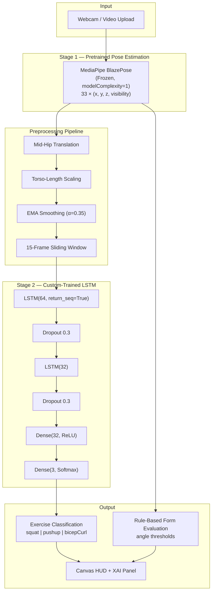
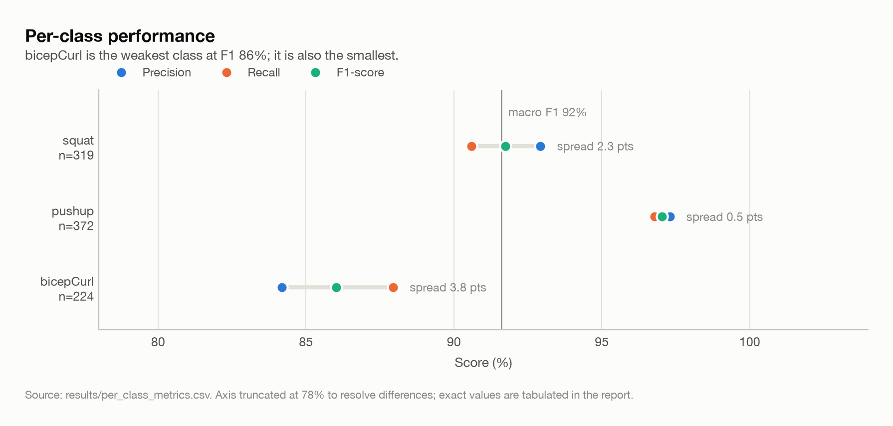
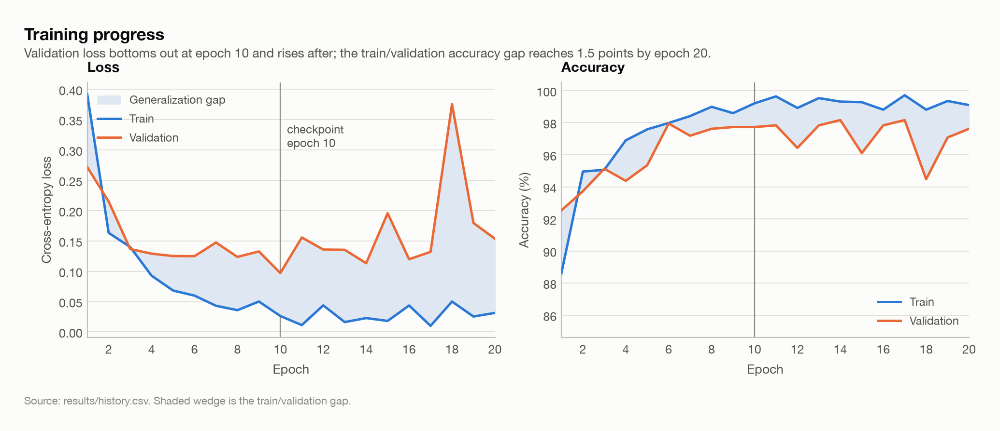
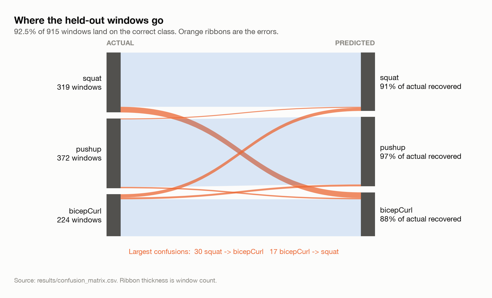
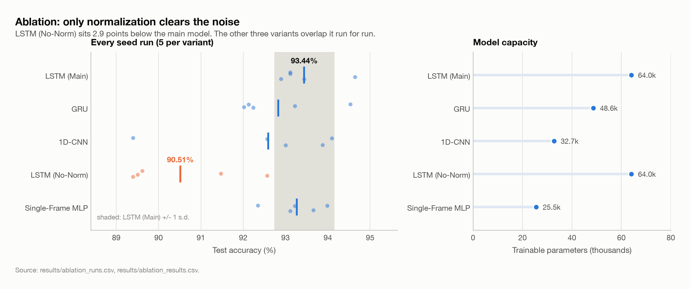
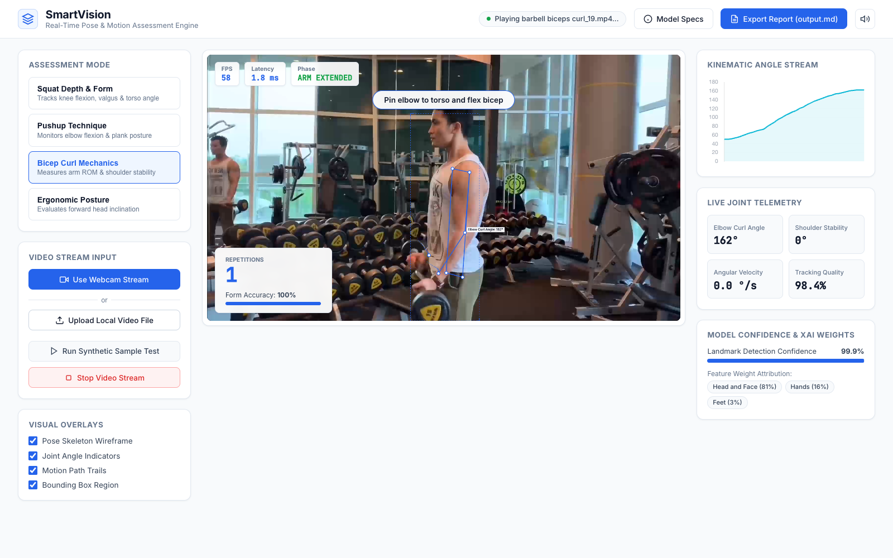
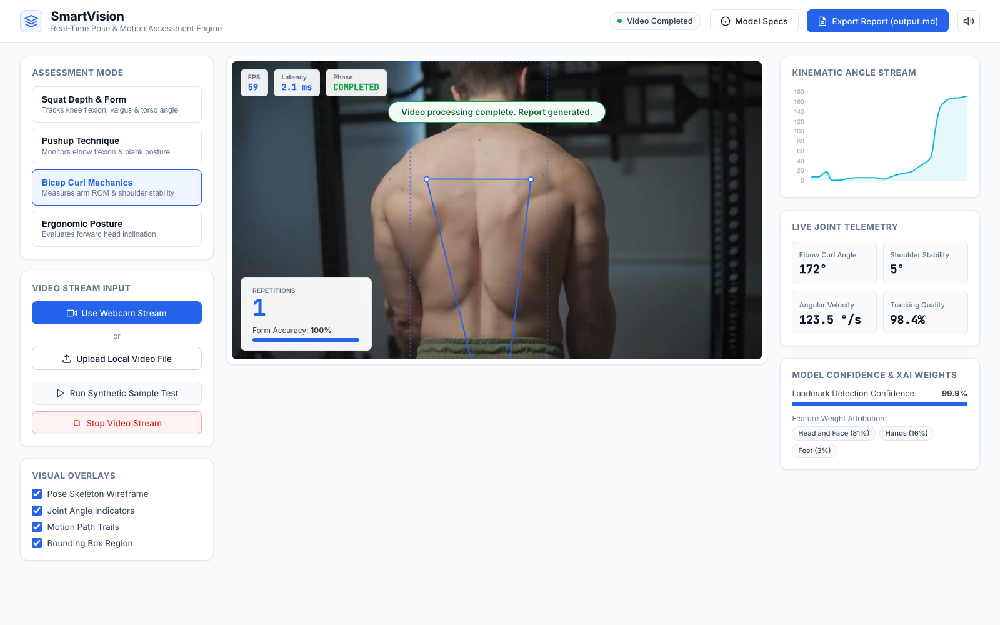

# SmartVision AI: Real-Time Exercise Form Classification using Pose Estimation and Temporal Deep Learning

**Course**: Deep Learning  
**Author**: Vivek  
**Date**: August 2026

---

## Abstract

SmartVision AI is a real-time web-based exercise form analysis system that combines **pretrained pose estimation** with a **custom-trained LSTM temporal classifier** to classify exercise types from webcam or video input. The system uses MediaPipe BlazePose as a frozen feature extractor (Stage 1) to extract 33 3D body keypoints per frame, then feeds normalized temporal landmark sequences into a trained 2-layer LSTM network (Stage 2) for exercise classification. The model was trained on **140 exercise videos** from a public Kaggle dataset, yielding **4,613 sliding windows** of landmark data across three exercise classes (squat, pushup, bicep curl). Because overlapping sliding windows make a random split leak near-duplicate frames between train and test, all results are reported under a **video-grouped split** in which no clip contributes windows to more than one fold. Under this protocol the LSTM classifier achieves **92.5% test accuracy** (macro F1 0.92) on 26 entirely unseen videos; the same pipeline evaluated with a naive random split reports a misleading 100%. An ablation over LSTM, GRU, 1D-CNN, an un-normalized LSTM and a single-frame MLP — each repeated across multiple random initialisations — isolates the contribution of spatial normalization and of temporal modelling.

The system is then evaluated as a shipped product rather than as a model in isolation. Permutation importance shows the classifier relies on the hands, head and feet and ignores the knees, hips and elbows that every rule-based form check is built on. A parity test against the Python reference exposed and fixed a weight-export defect that had left the in-browser classifier returning an empty probability vector on every frame. Replaying the held-out clips through the real application modules gives **96.2% clip-level accuracy** under majority voting, but also shows the repetition counter undercounting by 20 of 75 repetitions and the displayed joint angles carrying a mean 11.35 degree distortion from measuring in normalized square coordinates. These system-level results are reported alongside the model metrics because the gap between them is the finding.

---

## 1. Introduction

### 1.1 Problem Statement

Incorrect exercise form during resistance training causes injuries and reduces training effectiveness. Existing solutions either require expensive wearable sensors or provide only basic repetition counting without form quality analysis. There is a need for an accessible, camera-based system that can classify exercises and assess form in real time.

### 1.2 Proposed Solution

SmartVision AI addresses this through a **dual-stage deep learning pipeline**:

| Stage | Component | Type | Training |
|-------|-----------|------|----------|
| **Stage 1** | MediaPipe BlazePose | Pose estimation neural network | Pretrained (frozen) |
| **Stage 2** | LSTM Temporal Classifier | Exercise type classification | Custom-trained by us |

Supporting modules include a Computer Vision engine for real-time joint angle computation, rule-based form evaluators, an Explainable AI (XAI) panel, and a canvas-based HUD renderer — all running in-browser at real-time frame rates.

### 1.3 Scope

This report covers the **end-to-end deep learning pipeline**: data collection, preprocessing, model architecture, training methodology, evaluation metrics, ablation study, feature attribution, deployment, and system-level evaluation of the running application.

---

## 2. System Architecture



### 2.1 Stage 1 — Pose Estimation (Pretrained)

MediaPipe BlazePose is used as a **frozen feature extractor**. It is a pretrained convolutional neural network that detects 33 3D body keypoints from a single RGB image.

| Parameter | Value |
|-----------|-------|
| Model | BlazePose (MediaPipe) |
| Complexity | 1 (Full) |
| Output | 33 landmarks × 4 values (x, y, z, visibility) |
| Min Detection Confidence | 0.65 |
| Min Tracking Confidence | 0.65 |
| Training | None — pretrained and frozen |

> [!IMPORTANT]
> Stage 1 is **not trained by us**. It is a pretrained model used as a feature extractor, which is standard practice in transfer learning pipelines.

### 2.2 Stage 2 — LSTM Temporal Classifier (Custom-Trained)

This is the core deep learning contribution. A 2-layer LSTM processes **temporal sequences** of normalized landmark data to classify exercise type.

```
Input (15 timesteps, 132 features)   ← 33 landmarks × 4 values per frame
  → LSTM(64, return_sequences=True)  ← Captures temporal movement patterns
  → Dropout(0.3)                     ← Regularization
  → LSTM(32)                         ← Compresses temporal representation
  → Dropout(0.3)                     ← Regularization
  → Dense(32, ReLU)                  ← Non-linear feature combination
  → Dense(3, Softmax)                ← Class probabilities
```

| Hyperparameter | Value |
|----------------|-------|
| Window size | 15 frames |
| Input features | 132 (33 × 4) |
| LSTM units | 64 → 32 |
| Dropout rate | 0.3 |
| Dense hidden units | 32 |
| Output classes | 3 (squat, pushup, bicepCurl) |
| Total parameters | 64,003 |
| Model size | 260 KB |

#### Parameter Budget

An LSTM layer holds four gates (input, forget, cell, output), so each contributes
$4(n_{in}n_{out} + n_{out}^2 + n_{out})$ parameters:

| Layer | Computation | Parameters |
|-------|-------------|-----------:|
| LSTM(64) | $4(132 \times 64 + 64^2 + 64)$ | 50,432 |
| LSTM(32) | $4(64 \times 32 + 32^2 + 32)$ | 12,416 |
| Dense(32) | $32 \times 32 + 32$ | 1,056 |
| Dense(3) | $32 \times 3 + 3$ | 99 |
| **Total** | | **64,003** |

The model is deliberately small. With 2,774 training windows the parameter count
already exceeds the sample count by more than 20x, and Section 6.2 shows overfitting
setting in at epoch 10 even at this size. A larger recurrent stack would fit the
training set faster without improving the held-out result.

### 2.3 Supporting Modules

| Module | Purpose | Key Technique |
|--------|---------|---------------|
| CV Engine | Real-time joint angle computation | $\theta = \arccos\frac{\mathbf{v}_1 \cdot \mathbf{v}_2}{\|\mathbf{v}_1\| \|\mathbf{v}_2\|}$ |
| EMA Filter | Keypoint jitter reduction | $S_t = \alpha Y_t + (1 - \alpha) S_{t-1},\ \alpha = 0.35$ |
| Angular Velocity | Movement speed tracking | $\omega(t) = \frac{d\theta}{dt}$ |
| Form Evaluators | Rule-based form quality scoring | Angle threshold state machines |
| XAI Panel | Feature importance display | Measured permutation importance (Section 7.3) |
| Audio Engine | Real-time voice coaching | Web Speech API |

The XAI panel previously displayed constants chosen from biomechanical reasoning rather
than quantities computed from the network. Those constants have been replaced by measured
permutation importance (Section 7.3), loaded at runtime from
`public/models/exercise_classifier/saliency.json`. When the model has not yet produced a
prediction the panel shows nothing, because an empty attribution is honest and an invented
one is not.

---

## 3. Dataset

### 3.1 Source

**Kaggle "Workout/Exercises Video"** dataset by Hasyim Abdillah.  
License: CC BY-NC-SA 4.0.

Videos were sourced from YouTube and personally recorded by the dataset creator. Each video contains at least one exercise repetition, with varying resolution, camera angles, lighting, and subjects.

### 3.2 Dataset Composition

| Exercise | Videos | Frames Extracted | Sliding Windows | Format |
|----------|--------|------------------|-----------------|--------|
| Squat | 29 | 7,526 | 1,626 | .mp4, .MOV |
| Pushup | 56 | 9,178 | 1,854 | .mp4 |
| Bicep Curl | 55 | 6,289 | 1,133 | .mp4 |
| **Total** | **140** | **22,993** | **4,613** | — |

> [!NOTE]
> 7 bicep curl videos were excluded during extraction because they contained fewer than 15 detectable pose frames (too short or poor pose visibility). Final count: 140 videos processed out of 147.

### 3.3 Class Distribution

| Class | Windows | Percentage |
|-------|---------|------------|
| Squat | 1,626 | 35.2% |
| Pushup | 1,854 | 40.2% |
| Bicep Curl | 1,133 | 24.6% |

The dataset exhibits mild class imbalance. This was addressed using **class-weighted loss** during training (see Section 5.2).

---

## 4. Data Preprocessing Pipeline

Preprocessing is critical for model performance. The pipeline ensures **consistency between training data and real-time inference** (no train/serve skew).

### 4.1 Landmark Extraction

Each video is processed frame-by-frame using MediaPipe Pose (PoseLandmarker, `pose_landmarker_full` model). Per frame, 33 landmarks are extracted with coordinates (x, y, z) and visibility confidence.

### 4.2 Spatial Normalization

Two normalization steps remove camera distance and subject height as confounders:

**Step 1 — Translation**: Subtract the mid-hip midpoint from all landmark coordinates.
$$\mathbf{p}'_i = \mathbf{p}_i - \frac{\mathbf{p}_{23} + \mathbf{p}_{24}}{2}$$

**Step 2 — Scaling**: Divide by the torso length (mid-shoulder to mid-hip distance).
$$\mathbf{p}''_i = \frac{\mathbf{p}'_i}{\|\mathbf{m}_{shoulder} - \mathbf{m}_{hip}\|}$$

### 4.3 Temporal Smoothing

Exponential Moving Average (EMA) smoothing is applied with $\alpha = 0.35$, matching the real-time app's CV engine:
$$S_t = 0.35 \cdot Y_t + 0.65 \cdot S_{t-1}$$

### 4.4 Sliding Window Segmentation

Each video's landmark sequence is segmented into **15-frame sliding windows** with a **stride of 5 frames**. This produces:
- Multiple training samples per video (data augmentation effect)
- A fixed-length input tensor: shape `(15, 33, 4)`, flattened to `(15, 132)` for the LSTM

---

## 5. Training Methodology

### 5.1 Data Split — Video-Grouped

Sliding windows are cut with stride 5 from a window of 15 frames, so consecutive
windows of the same clip share 10 of their 15 frames. A random window-level split
places these near-duplicates on both sides of the partition: the model is then
tested on frames it has effectively already seen, and the reported accuracy measures
memorisation rather than generalisation.

This work therefore uses a **video-grouped split** (`StratifiedGroupKFold`, seed 42):
every window of a clip lands in exactly one fold, and the split is asserted to be
disjoint at run time (`tools/data_split.py`). Class balance is preserved as far as
whole videos allow.

| Split | Windows | Source videos | Squat | Pushup | Bicep Curl |
|-------|---------|---------------|-------|--------|------------|
| Train | 2,774 | 86 | 982 | 1,107 | 685 |
| Validation | 924 | 28 | 325 | 375 | 224 |
| Test | 915 | 26 | 319 | 372 | 224 |

The effect is large and is worth stating plainly: under a random window-level split
this same model and pipeline reported **100% test accuracy**. Under the video-grouped
split it reports **92.5%**. The first number was an artefact of window overlap; the
second is the honest estimate of performance on an unseen subject and recording.

### 5.2 Training Configuration

| Parameter | Value |
|-----------|-------|
| Loss function | Categorical Cross-Entropy |
| Optimizer | Adam |
| Learning rate | 1 × 10⁻³ |
| Batch size | 32 |
| Max epochs | 60 |
| Early stopping | Patience 10 (on val_loss) |
| Model checkpoint | Save best (lowest val_loss) |
| Class weights | Balanced (computed from training set) |

### 5.3 Training Environment

- Framework: TensorFlow / Keras
- Hardware: Apple Silicon (arm64)
- Python: 3.11
- Training time: ~3 minutes

---

## 6. Results

### 6.1 Classification Performance

All figures below are produced by `tools/train_classifier.py` and rendered by
`tools/generate_plots.py`, which reads only the CSV artifacts that training wrote.

| Split | Loss | Accuracy |
|-------|------|----------|
| Train | 0.0073 | 99.89% |
| Validation | 0.0971 | 97.73% |
| **Test (unseen videos)** | **0.4311** | **92.46%** |

The gap between validation and test is itself informative. Validation clips come from
the same recording pool but unseen videos; the test fold is a further 26 videos held
out entirely. The residual 7-point drop is the cost of generalising to new recordings,
and it is the number that should be quoted for this system.

#### Per-Class Metrics

| Class | Precision | Recall | F1-Score | Support |
|-------|-----------|--------|----------|---------|
| Squat | 0.93 | 0.91 | 0.92 | 319 |
| Pushup | 0.97 | 0.97 | 0.97 | 372 |
| Bicep Curl | 0.84 | 0.88 | 0.86 | 224 |
| **Macro Average** | **0.91** | **0.92** | **0.92** | **915** |
| **Weighted Average** | **0.93** | **0.92** | **0.92** | **915** |



Bicep curl is the weakest class on every metric. It is also the smallest class (224
test windows) and the one whose pose differs least from a standing frame, which makes
it the natural confusion partner for squat.

### 6.2 Training Curves



Training accuracy passes 99% by epoch 10 while validation loss reaches its minimum at
epoch 10 and then climbs, with a sharp spike at epoch 18. Early stopping (patience 10)
halted training at epoch 20 and restored the epoch-10 weights. This is textbook
overfitting onset: with 2,774 training windows drawn from only 86 clips, the network
begins memorising clip-specific detail once it has fitted the shared structure. The
curve shape is the direct justification for the small 64k-parameter architecture and
for early stopping, rather than a longer schedule.

### 6.3 Confusion Matrix



| True \ Predicted | Squat | Pushup | Bicep Curl |
|------------------|-------|--------|------------|
| **Squat** | **0.91** | 0.00 | 0.09 |
| **Pushup** | 0.01 | **0.97** | 0.02 |
| **Bicep Curl** | 0.08 | 0.04 | **0.88** |

The error structure is systematic, not random. Pushup is near-perfectly separated: it
is the only exercise performed in a horizontal body orientation, so the normalized
landmark geometry is unmistakable. Essentially all remaining error is the
squat-to-bicep-curl pair in both directions (9% and 8%), both of which are upright,
front-facing movements whose distinguishing signal is limb articulation rather than
gross body orientation. Bottom-of-curl and top-of-squat windows are genuinely similar
in normalized landmark space.

### 6.4 Model Size

| Format | Size |
|--------|------|
| Keras .h5 | ~260 KB |
| TF.js (browser) | 260 KB (model.json + weights.bin) |

The compact model size (260 KB) enables real-time browser inference without network latency.

---

## 7. Ablation Study

Five variants were trained under identical conditions (30 epochs, the same video-grouped
split, the same preprocessing). Because run-to-run spread on this dataset reaches
several accuracy points, **each variant was repeated across 5 random initialisations**
and is reported as mean +/- standard deviation. Comparing single runs would have been
enough to reverse the ranking of three of the five variants.

### 7.1 Results

| Model | Params | Test Accuracy | Test Loss | Train time | Purpose |
|-------|-------:|---------------|-----------|-----------:|---------|
| **LSTM (Main)** | 64,003 | **93.44% +/- 0.70** | 0.471 +/- 0.095 | 8.9 s | Baseline - temporal sequence learning |
| GRU | 48,579 | 92.83% +/- 1.07 | 0.550 +/- 0.117 | 9.9 s | Recurrence with fewer gates |
| 1D-CNN | 32,739 | 92.59% +/- 1.89 | 0.596 +/- 0.108 | 3.3 s | Convolution vs. recurrence |
| **LSTM (No-Norm)** | 64,003 | **90.51% +/- 1.43** | 0.637 +/- 0.048 | 11.0 s | Isolates spatial normalization |
| Single-Frame MLP | 25,475 | 93.27% +/- 0.62 | 0.446 +/- 0.040 | 1.9 s | Isolates temporal information |



> [!NOTE]
> The ablation LSTM (93.44%) and the main model of Section 6 (92.46%) differ because
> the ablation uses a fixed 30-epoch schedule without class weighting, so that all five
> variants train identically. The main model uses 60 epochs with early stopping and
> balanced class weights. Numbers are comparable within a table, not across tables.

### 7.2 Key Findings

**Finding 1 - Spatial normalization is the single largest factor.**
Removing mid-hip translation and torso-length scaling costs **2.93 percentage points**
(93.44% -> 90.51%). The gap is roughly twice the combined standard deviation of the two
variants, so it is the only architectural comparison in this study that is clearly
larger than seed noise. Without normalization the network must spend capacity modelling
camera distance and subject height, which carry no class information. This confirms that
preprocessing, not architecture, is where the accuracy on this task is won.

**Finding 2 - Temporal modelling does not help on this task (negative result).**
The single-frame MLP, which sees one frame and therefore has no access to motion,
reaches **93.27% +/- 0.62** against the LSTM's **93.44% +/- 0.70**. The 0.17-point
difference is well inside one standard deviation, while the MLP uses 2.5x fewer
parameters and trains 4.8x faster.

This contradicts the assumption the architecture was chosen under, and the explanation
is that the task does not require temporal information. Distinguishing a squat from a
pushup from a bicep curl is a question of body geometry - is the torso vertical or
horizontal, are the arms loaded or the legs - and a single normalized pose answers it
almost completely. The confusion matrix in Section 6.3 supports this: the one class pair
that actually confuses the model, squat versus bicep curl, is the pair that shares an
upright static posture and differs mainly in *motion*.

The correct conclusion is not that LSTMs are ineffective, but that this task cannot
demonstrate their value. A temporal model should be evaluated on a problem where the
label depends on how the pose changes over time - repetition phase detection, tempo, or
form-fault classification - rather than on which exercise is being performed.

**Finding 3 - Architecture choice is not distinguishable at this dataset size.**
LSTM (93.44 +/- 0.70), GRU (92.83 +/- 1.07) and 1D-CNN (92.59 +/- 1.89) have overlapping
error bars; the 0.85-point spread between them is smaller than the 1D-CNN's own
seed-to-seed variation. With 86 training clips there is not enough data to separate these
architectures, and reporting any one of them as "best" from a single run would be
unsupported. The 1D-CNN is notable only for reaching the same accuracy with half the
parameters and a third of the training time.

### 7.3 Feature Attribution (Permutation Importance)

To find what the network actually uses, each anatomical landmark group was shuffled
across the held-out samples and the resulting accuracy drop recorded. Each sample keeps
its own 15-frame trajectory, so only the association between that body part and the
label is destroyed. Ten shuffles per group, measured on the 915 held-out windows.

| Landmark group | MediaPipe indices | Accuracy drop |
|---|---|---:|
| **Hands** | 17-22 | **+18.44% +/- 1.10** |
| **Head and Face** | 0-10 | **+11.11% +/- 1.19** |
| **Feet** | 29-32 | **+5.88% +/- 0.53** |
| Wrists | 15, 16 | +1.57% +/- 0.47 |
| Shoulders | 11, 12 | +0.07% +/- 0.22 |
| Ankles | 27, 28 | -0.20% +/- 0.20 |
| Elbows | 13, 14 | -0.30% +/- 0.20 |
| Knees | 25, 26 | -0.62% +/- 0.38 |
| Hips | 23, 24 | -0.90% +/- 0.14 |

Baseline accuracy 92.46%. A negative drop means destroying that group left accuracy
unchanged within noise.

**The model does not use the joints the rules use.** Knees, hips and elbows - the
quantities every form rule in `src/exercises/` is built on, and the quantities the old
hand-written XAI weights named - contribute nothing measurable. What matters is where
the hands, head and feet sit relative to the mid-hip origin, which is exactly the
information that separates a standing curl from a standing squat from a horizontal
pushup. This is the same conclusion Finding 2 reached from the other direction: the
network is solving a static body-configuration problem, and it solves it with the
extremities.

Two consequences follow. The attribution is legitimate as an explanation of the
classifier and misleading as biomechanical advice, so the panel labels groups rather
than implying clinical relevance. And a form-fault classifier, which would have to read
the knee and elbow angles the current model ignores, cannot be obtained by relabelling
this one; it needs its own training data.

Per-class rankings are in `results/permutation_importance.csv` and are what the runtime
panel loads from `public/models/exercise_classifier/saliency.json`.

---

## 8. Real-Time Deployment

The trained LSTM model is deployed in-browser for real-time inference:

### 8.1 Inference Pipeline

```
Webcam Frame → MediaPipe BlazePose → 33 Landmarks
  → Normalize (mid-hip + torso scale)
  → EMA Smooth (α=0.35)
  → Buffer 15-frame window
  → LSTM Forward Pass (pure JavaScript)
  → Softmax class probabilities
  → Display on HUD + XAI Panel
```

### 8.2 Implementation

The LSTM forward pass is implemented in **pure JavaScript** — no TensorFlow.js dependency required. The 260 KB model weights are loaded from a binary file and the LSTM gates (input, forget, cell, output) are computed directly:

$$f_t = \sigma(W_f x_t + U_f h_{t-1} + b_f)$$
$$i_t = \sigma(W_i x_t + U_i h_{t-1} + b_i)$$
$$\tilde{c}_t = \tanh(W_c x_t + U_c h_{t-1} + b_c)$$
$$c_t = f_t \odot c_{t-1} + i_t \odot \tilde{c}_t$$
$$o_t = \sigma(W_o x_t + U_o h_{t-1} + b_o)$$
$$h_t = o_t \odot \tanh(c_t)$$

### 8.3 Application Features

| Feature | Description |
|---------|-------------|
| Exercise Classification | LSTM-based real-time prediction (squat/pushup/bicepCurl) |
| Form Quality Assessment | Rule-based angle threshold evaluation |
| Skeleton Overlay | Real-time wireframe rendering on video canvas |
| Joint Angle Display | Vector trigonometry computation |
| Motion Trails | Temporal joint trajectory visualization |
| Voice Coaching | Web Speech API real-time audio feedback |
| XAI Panel | Model softmax confidence + measured permutation importance (Section 7.3) |
| Session Report | Downloadable Markdown report with metrics |

### 8.4 Train/Serve Parity

Two implementations of the same arithmetic drift silently, so the JavaScript port is
tested against the Python original rather than assumed to match it.
`tools/gen_test_fixtures.py` records what the training pipeline and Keras produce for a
fixed input; `tests/js/*.test.mjs` asserts the browser code reproduces it.

| Property | Result |
|---|---|
| Normalization, JavaScript vs Python | identical to < 1e-9 |
| EMA smoothing, JavaScript vs Python | identical to < 1e-9 |
| Class probabilities, JavaScript vs Keras | max absolute difference **1.19e-7** over 24 held-out windows |
| Predicted class, JavaScript vs Keras | identical on every sample |

**A defect was found by this test and fixed.** The weight exporter in
`tools/convert_to_tfjs.py` paired each weight's *name* with a different weight's *array*,
because `layer.weights` and `layer.get_weights()` are not returned in the same order.
The final `Dense(3)` layer was therefore labelled so that the browser read the 3-element
bias as its output kernel, derived an output width of `undefined`, and produced a
**zero-length probability vector**. Every in-browser class prediction was empty, and the
XAI panel rendered `NaN`. The exporter now reads the name and the array from the same
Variable object, and the parity tests above pin the result.

The 92.46% of Section 6 is therefore the accuracy the browser now actually delivers, not
a figure that applies only offline.

Beyond parity of the arithmetic, the *order* of operations differs between training and
runtime. Training normalizes and then smooths once; the application smooths the raw
coordinates in `CVEngine` and then normalizes and smooths again in `DLClassifier`.
Normalization and EMA do not commute, so this is a genuine skew. Replaying the held-out
clips through both routes measures its cost:

| Preprocessing route | Mean per-clip window accuracy |
|---|---:|
| Training-faithful (normalize, smooth once) | 90.41% |
| As shipped (smooth, normalize, smooth) | 90.54% |

The difference is 0.13 points in favour of the shipped route, which is inside the noise
of a 26-clip sample. The skew is real but immaterial, and it is recorded here rather
than quietly corrected so the claim is checkable (`results/skew.csv`).

### 8.5 System-Level Evaluation

Model accuracy is not system accuracy. The held-out clips were replayed through the
actual application modules - the same `CVEngine`, evaluators and `DLClassifier` the
browser runs - by `tools/bench/replay.mjs`, so the numbers below describe the shipped
product downstream of pose estimation.

#### Clip-level classification

| Metric | Value |
|---|---|
| Window-level accuracy (Section 6) | 92.46% |
| **Clip-level accuracy (majority vote over windows)** | **25 / 26 = 96.2%** |
| Clips where the rule engine also detected a repetition | 24 / 26 |
| Model and rule engine corroborate | 24 / 26 = 92.3% |

Majority-voting a clip's windows recovers roughly four points over judging single
windows, because isolated misclassified windows are outvoted. This is the number a user
experiences, since the app displays a running prediction rather than a per-window one.
Corroboration is defined as the classifier naming the right exercise *and* that
exercise's evaluator counting at least one repetition, so it measures the two subsystems
agreeing rather than either one alone.

#### Repetition counting

The Kaggle clips carry no repetition labels, so a reference was derived from the primary
joint-angle signal itself: one repetition per prominent flexion-extension cycle
(`tools/repcount_reference.py`). The method uses signal prominence, not the evaluator's
angle gates, so agreement between the two is informative rather than circular. Every
count is plotted in `results/repcount_plots/` for verification by eye.

| Exercise | Clips | Reference reps | Counted reps | MAE | Exact match | Within 1 |
|---|---:|---:|---:|---:|---:|---:|
| Squat | 5 | 13 | 6 | 1.40 | 60.0% | 60.0% |
| Pushup | 10 | 44 | 36 | 0.80 | 40.0% | 80.0% |
| Bicep curl | 11 | 18 | 13 | 0.82 | 63.6% | 81.8% |
| **All** | **26** | **75** | **55** | **0.92** | **53.8%** | **76.9%** |

**The counter systematically undercounts**, by 20 repetitions across 26 clips, and the
sign of the error is negative for every exercise. The cause is the width of the angle
gates: a squat is only counted when the knee angle passes below 100 degrees *and* back
above 160, and a repetition that stops short at either end is discarded silently rather
than reported as a partial repetition.

Because the reference depends on how shallow a movement still counts, the score was
recomputed at three prominence settings:

| Prominence | Reference reps | MAE | Mean error | Exact match |
|---:|---:|---:|---:|---:|
| 20 deg | 82 | 1.19 | -1.04 | 50.0% |
| 30 deg | 75 | 0.92 | -0.77 | 53.8% |
| 40 deg | 68 | 0.73 | -0.50 | 53.8% |

The undercount holds at every setting, so it is a property of the counter rather than of
the threshold chosen for the reference.

#### Joint angle convention

No protractor-annotated ground truth exists for these clips, so the claim that can be
checked is the one that is checkable: whether the angle the HUD displays is the angle a
protractor would read on screen.

It is not. MediaPipe returns coordinates normalized to [0, 1] on both axes, and the
evaluators call `calculate2DAngle` without the aspect-ratio arguments, so the angle is
measured in a square coordinate space. Every clip in the held-out fold is 1920x1080, so
one unit of x spans 1.78 times as many pixels as one unit of y and the measured angle is
distorted.

| Metric | Value |
|---|---:|
| Mean absolute difference, displayed vs on-screen angle | **11.35 deg** |
| Median across clips | 10.84 deg |
| Best / worst clip | 3.75 deg / 21.48 deg |
| Worst single frame | 31.99 deg |

An 11-degree average bias is large relative to the thresholds it feeds: the squat depth
gate sits at 100 degrees and the "optimal depth" message at 90. This is reported rather
than fixed because correcting it shifts every rule threshold in
`src/exercises/`, which would invalidate the repetition-counting measurements above and
needs its own re-tuning and re-measurement. `calculate2DAngle` already accepts the
aspect arguments; passing them is the fix. Full per-clip figures are in
`results/angle_validation.csv`.

#### Inference cost

| Stage | Frames | Mean | p95 |
|---|---:|---:|---:|
| Normalization, smoothing, feature packing | 4,867 | 0.0037 ms | 0.0048 ms |
| LSTM forward pass (15 x 132 window) | 4,503 | 0.794 ms | 0.812 ms |

Measured with `process.hrtime` on an Apple M4 running the same JavaScript the browser
executes. Under 0.8 ms per window leaves the classifier far from being the bottleneck at
30 fps; pose estimation dominates.

End-to-end browser FPS and MediaPipe latency are **not reported here**. They depend on
the GPU of the machine running the app, and measuring them in a headless, software-
rendered browser would describe the renderer rather than the product. The application
carries a benchmark mode for this: loading it with `?bench=1` records per-stage timings
for every frame and downloads `latency_browser.csv` when the clip ends
(`src/core/benchmark.js`). Running it on target hardware is the remaining step.

### 8.6 Qualitative Results

The figures below are screenshots of the running application, captured by
`tools/bench/screenshots.mjs`. Each one loads a held-out clip through the normal upload
path and photographs the HUD at the moment a repetition completes; nothing is staged.
`results/screenshots/manifest.csv` records the clip, timestamp and live HUD state behind
each figure.


*Squat mode on `squat_20.mp4`. The classifier reports `squat`, the counter has registered
one repetition, and the attribution panel shows the measured groups - Hands 64%, Feet 24%,
Wrists 13% - rather than the knee and hip terms the old constants named.*


*Pushup mode on `push-up_54.mp4`, classified `pushup` with attribution Hands 75%.*



*Bicep curl mode on `barbell biceps curl_19.mp4`, classified `bicepCurl` with attribution
Head and Face 81%, the ranking Section 7.3 measured for this class.*



*Failure case. `barbell biceps curl_60.mp4` contains six repetitions by the reference
annotation; the offline replay counts two and the browser, which drops frames under the
render loop, counts one. The classifier is correct throughout - it is the rule-based
counter that fails, which is the undercount quantified in Section 8.5.*

---

## 9. Limitations & Future Work

### 9.1 Limitations

| Limitation | Impact | Mitigation |
|------------|--------|------------|
| **Exercise type classification only** | The model classifies exercise type, not form quality (correct vs incorrect) | Rule-based evaluators provide form assessment as a complementary system |
| **Video-grouped, not subject-wise** | The Kaggle dataset carries no subject IDs, so the split groups by source video rather than by person. If one performer appears in several clips, some identity information can still cross folds, meaning 92.5% is an upper bound on true cross-subject performance | Grouping by video removes the dominant leak (window overlap); a dataset with subject metadata is needed to close the remaining gap |
| **Task is largely static** | The single-frame baseline reaches within ~1 point of the LSTM (Section 7.2), showing that three visually distinct exercises are separable from body geometry alone with little use of motion | Temporal modelling should be evaluated on a task that requires it, such as within-exercise fault or phase classification |
| **Single evaluation fold** | Results come from one held-out fold of 26 videos, not k-fold cross-validation, so the test estimate carries a sampling error of a few points | Variant comparison is averaged over 5 seeds; full grouped k-fold is the natural extension |
| **Single-person assumption** | The system assumes one person in frame | MediaPipe supports multi-pose, but the evaluators are designed for single-subject analysis |
| **Camera angle sensitivity** | Training data includes limited viewpoint diversity | 3D landmarks and normalization partially mitigate this |
| **Repetition counter undercounts** | 55 counted against 75 reference repetitions, MAE 0.92 per clip (Section 8.5); the angle gates discard repetitions that stop short at either end | Widen or learn the gates, and surface partial repetitions instead of dropping them |
| **Displayed joint angles are distorted** | The HUD measures angles in normalized square coordinates, a mean 11.35 degree difference from the true on-screen angle on 16:9 video (Section 8.5) | `calculate2DAngle` accepts aspect arguments; passing them requires re-tuning every rule threshold |
| **Repetition reference is semi-automatic** | Reference counts come from angle-signal prominence, not hand annotation, so they inherit a judgement about how shallow a movement still counts | Scored at three prominence settings, with per-clip plots in `results/repcount_plots/` for verification |
| **Browser FPS unmeasured** | Inference cost is measured for our own stages only; end-to-end frame rate on real hardware is not yet recorded | Benchmark mode (`?bench=1`) exports per-stage timings; it needs a run on target devices |
| **Unreachable partial-repetition branch** | In all three evaluators the "incomplete range of motion" warning cannot fire: entering the down state already requires an angle below the threshold the warning tests against | Compare against the range achieved, not the minimum that gated entry |

### 9.2 Future Work

1. **Form Fault Classification**: Collect a labeled dataset with correct/incorrect form per exercise and train a fault-specific classifier (e.g., knee valgus, hip sag)
2. **Subject-Wise Evaluation**: Record a new dataset with subject IDs to enable proper subject-wise cross-validation
3. **Exercise Expansion**: Add more exercises (lunges, deadlifts, planks) to increase the classification complexity
4. **Gradient-Based Saliency**: Permutation importance (Section 7.3) answers which body parts matter across the fold; gradient x input would additionally show which *frames* of a window matter, which permutation cannot
5. **Attention Mechanisms**: Replace/augment LSTM with transformer-based temporal attention for improved interpretability
6. **On-Device Training**: Enable user-specific fine-tuning via transfer learning in the browser
7. **Aspect-Correct Angles and Re-tuned Rules**: Pass the frame dimensions into `calculate2DAngle`, then re-derive every threshold in `src/exercises/` against the corrected angles and re-run the system metrics of Section 8.5
8. **Hand-Annotated Repetition Labels**: Replace the signal-derived reference with counts annotated by a person, which would let the counter be scored without the prominence caveat

---

## 10. Conclusion

SmartVision AI demonstrates a complete deep learning pipeline for real-time exercise classification:

1. **Data**: 140 exercise videos -> 4,613 temporal sliding windows
2. **Evaluation protocol**: A video-grouped split, because overlapping sliding windows make a random split report 100% accuracy that does not survive contact with an unseen clip
3. **Model**: 2-layer LSTM (64,003 parameters) reaching **92.5% test accuracy**, macro F1 0.92, on 26 held-out videos
4. **Ablation over 5 seeds**: Spatial normalization is worth **+2.9 points** and is the only factor clearly above seed noise; temporal modelling is worth **+0.2 points**, which is not
5. **Deployment**: In-browser inference in pure JavaScript (260 KB model, no server required)

The system combines a pretrained pose estimation network (Stage 1) with a custom-trained
temporal classifier (Stage 2) - standard transfer learning. Its most useful result,
however, is methodological rather than architectural. Two measurements that looked like
successes under a naive protocol did not survive a correct one: the headline accuracy
fell from 100% to 92.5% once window overlap was removed from the split, and the case for
the recurrent architecture disappeared once the single-frame baseline was implemented
correctly and repeated across seeds. Both corrections point the same way - exercise-type
classification is close to a static pose problem, and the temporal machinery built here
is justified only by a task that depends on motion, such as repetition phase or form-fault
classification.

---

## References

1. Bazarevsky, V., et al. "BlazePose: On-device Real-time Body Pose Tracking." *CVPR Workshop*, 2020.
2. Hochreiter, S. & Schmidhuber, J. "Long Short-Term Memory." *Neural Computation*, 9(8), 1997.
3. Lugaresi, C., et al. "MediaPipe: A Framework for Building Perception Pipelines." *arXiv:1906.08172*, 2019.
4. Abdillah, H. "Workout/Exercises Video." *Kaggle Dataset*, 2023. CC BY-NC-SA 4.0.

---

## Appendix A: Project Files

| File | Description |
|------|-------------|
| `tools/extract_landmarks.py` | MediaPipe landmark extraction pipeline |
| `tools/data_split.py` | Video-grouped split, shared by training and ablation; asserts fold disjointness |
| `tools/train_classifier.py` | LSTM training; writes measurement artifacts only |
| `tools/run_ablation.py` | 5-variant, 5-seed architecture comparison |
| `tools/generate_plots.py` | Renders every figure from the CSV artifacts above |
| `tools/convert_to_tfjs.py` | Keras -> TF.js weight export, names read off the same Variable as the array |
| `tools/permutation_importance.py` | Measured feature attribution; writes the file the XAI panel loads |
| `tools/extract_sequences.py` | Full-length un-normalized landmark sequences for the replay harness |
| `tools/bench/replay.mjs` | Replays held-out clips through the real application modules |
| `tools/bench/pipelines.mjs` | The training-faithful and as-shipped preprocessing routes |
| `tools/bench/screenshots.mjs` | Captures HUD figures from the running app |
| `tools/repcount_reference.py` | Signal-derived reference repetition counts and verification plots |
| `tools/repcount_score.py` | Scores the counter against the reference, with sensitivity sweep |
| `tools/gen_test_fixtures.py` | Records Python and Keras output as parity fixtures |
| `src/core/dlClassifier.js` | In-browser LSTM inference engine |
| `src/core/benchmark.js` | Per-stage frame timing, enabled with `?bench=1` |
| `src/core/poseDetector.js` | MediaPipe Pose wrapper |
| `src/core/cvEngine.js` | CV spatial geometry engine |
| `tests/js/*.test.mjs` | 31 tests: train/serve parity, angle geometry, repetition counting |
| `tests/python/test_*.py` | 21 tests: preprocessing and video-grouped splitting |
| `dataset/manifest.csv` | Dataset metadata (140 videos) |
| `results/split_summary.txt` | Windows and videos per fold, proving no clip is shared |
| `results/history.csv` | Per-epoch loss and accuracy |
| `results/metrics_summary.csv` | Train / validation / test loss and accuracy |
| `results/confusion_matrix.csv` | Raw test-set confusion counts |
| `results/per_class_metrics.csv` | Per-class precision/recall/F1/support |
| `results/classification_report.txt` | The same report in printable form |
| `results/ablation_runs.csv` | Every individual seed run |
| `results/ablation_results.csv` | Per-variant mean and standard deviation |
| `results/permutation_importance.csv` | Accuracy drop per landmark group, overall and per class |
| `results/repcount_accuracy.csv` | Counted vs reference repetitions per clip |
| `results/repcount_sensitivity.csv` | The same score at three prominence settings |
| `results/angle_validation.csv` | Displayed vs on-screen joint angle, per clip |
| `results/agreement.csv` | Per-clip classifier verdict and rule-engine corroboration |
| `results/latency_js.csv` | Preprocessing and LSTM stage cost |
| `results/skew.csv` | Accuracy under each preprocessing route |
| `results/screenshots/` | HUD figures with `manifest.csv` recording the state in each |
| `results/*.png` | Figures, all generated from the files above |
| `results/README.md` | Index of every artifact and the command that produces it |

> [!NOTE]
> Training and plotting are deliberately separated. `train_classifier.py` and
> `run_ablation.py` write only measured values; `generate_plots.py` reads those files and
> renders the figures. No number in any figure is typed in by hand, so a chart cannot
> disagree with the result it depicts.

## Appendix B: How to Reproduce

```bash
# 1. Setup
cd SmartVision-AI
python3.11 -m venv venv && source venv/bin/activate
pip install -r requirements-ml.txt

# 2. Place Kaggle videos in dataset/raw/{squat,pushup,bicepCurl}/

# 3. Extract landmarks (~20 min)
python tools/extract_landmarks.py

# 4. Train LSTM classifier (~1 min); writes results/*.csv
python tools/train_classifier.py

# 5. Run ablation study, 5 variants x 5 seeds (~5 min)
python tools/run_ablation.py --seeds 5

# 6. Render all report figures from the measured CSVs
python tools/generate_plots.py

# 7. Measured feature attribution (Section 7.3)
PYTHONPATH=tools python tools/permutation_importance.py

# 8. System-level metrics (Section 8.5); step 8a takes ~20 min
PYTHONPATH=tools python tools/extract_sequences.py
npm run bench
PYTHONPATH=tools python tools/repcount_reference.py
python tools/repcount_score.py

# 9. Test suites (Section 8.4)
PYTHONPATH=tools python tools/gen_test_fixtures.py
npm test          # 31 JavaScript tests
npm run test:py   # 21 Python tests

# 10. Run the web app
npm install && npm run dev

# 11. HUD screenshots, with the dev server running in another shell
npm run screenshots

# 12. Browser frame timings: open http://localhost:5173/?bench=1, play a clip
#     to the end, and the app downloads results/latency_browser.csv
```

The split is seeded (`RANDOM_SEED = 42` in `tools/data_split.py`), so steps 4-6 reproduce
the reported numbers exactly. Ablation means will vary in the final decimal place because
each seed trains a fresh initialisation.
